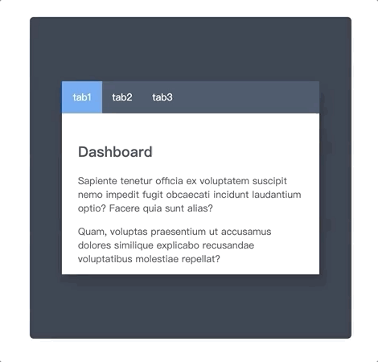

# CssChallenge-day7



如果想实现tab之间的切换，可以利用`type=radio`的三个input，设置相同name属性时的单选效果来实现，通过**label for input**来将点击事件绑定到**input**上。

代码如下：
```html
  <input type="radio" name="rd" id="tab-1" />
  <label for="tab-1" class="tab">tab1</label>
  <input type="radio" name="rd" id="tab-2" />
  <label for="tab-2" class="tab">tab2</label>
  <input type="radio" name="rd" id="tab-3" />
  <label for="tab-3" class="tab">tab3</label>
```

下一部需要做的就是将content的动画和相应的input的focus状态绑定起来：

```css
  #tab-1:checked ~ .contents #content-1,
  #tab-2:checked ~ .contents #content-2,
  #tab-3:checked ~ .contents #content-3  {
    pointer-events: all;
    opacity: 1;
    transform: translateY(0);
    transition: all .5s ease-out .4s;
  }
```

需要注意一点就是label的层级必须比content要高，下面代码类似叔侄关系:
```html
  <input type="radio" name="rd" id="tab-3" />
  <label for="tab-3" class="tab">tab3</label>
  <div class="contents">
    <div id="content-1" class="content content-1">
      ...
    </div>
    <div id="content-2" class="content content-2">
      ...
    </div>
    <div id="content-3" class="content content-3">
      ...
    </div>
  </div>
```