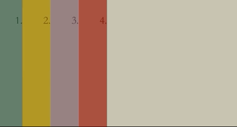

# CssChallenge-day8



在Css中，可以通过`--`开头的命名方式来定义**custom attribute**，如：
```css
:root {
  --nav-item-offset: 10vw;
  --easing: cubic-bezier(.8, 0, .2, 1);
  --duration: .6s;
}
```

使用时使用var()来引用，下面的代码中，通过translateX来控制左右滑动的动画，通过slide-down和animation-delay一起控制下滑的动画：
```css
  transition: transform var(--easing) var(--duration);
  transform: translateX(calc(-100% + var(--nav-item-offset)));
  animation: slide-down 1s cubic-bezier(0.5, 0, 0.3, 1);
  animation-delay: calc(var(--i) * .15s);
  animation-fill-mode: backwards;
```
